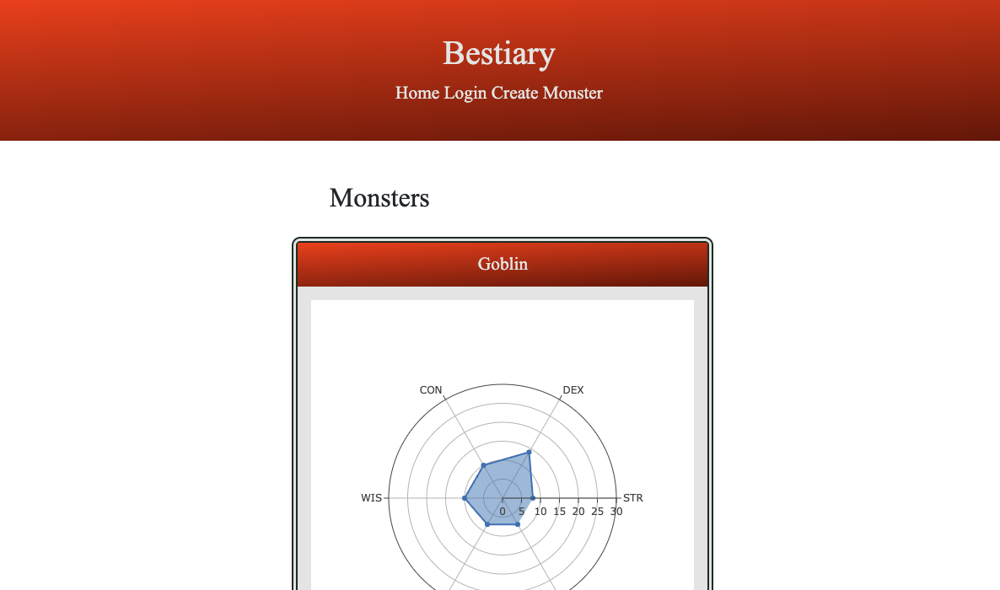

# Bestiary

## User Story

As a user, I want to create a unique monster for my tabletop game so that I can keep track of the monster's data as it relates to my campaign.

## Description

For this project, Team Goblin Mode created a bestiary that is intended to accompany a tabletop gaming platform. The purpose of the web application is to generate a monster with stats and saves it to a database. The user must login before they can access the monster creator tool. Once logged in, the user can input the monster stats and generate the monster. They will be able to see their created monster on the homepage. Plotly is an outside asset that the group utilized to visualize the monster stats. It is uniquely generated based on the monster it is representing.

## Installation

No installation is necessary to run this application. All the user needs to do is click on the live link below in the "Link to deployed application". Once the user accesses the live link they will need to navigate to the "sign up" section of the web application. After signing up the user should click on the "sign in" section to log into the site. The user now has access to create a monster. The web application will remember the created monsters on the user's account.   

## Link to deployed application

https://knave-bestiary.herokuapp.com/

## Screenshot

## Technologies Used

* Heroku
* Handlebars
* Plotly
* HTML
* CSS
* Node JS
* Express
* MySQL
* Javascript
* Bootstrap

## Contact Info for Team Goblin Mode

Seth Daulton - seth.daulton@gmail.com
Diana Macias - dianamacias1218@icloud.com
Skipper Thurman - slthurman01@gmail.com
